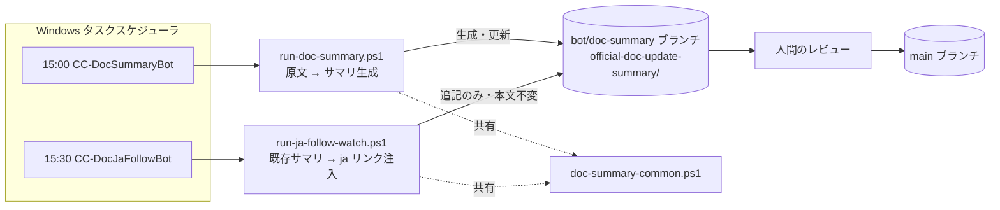
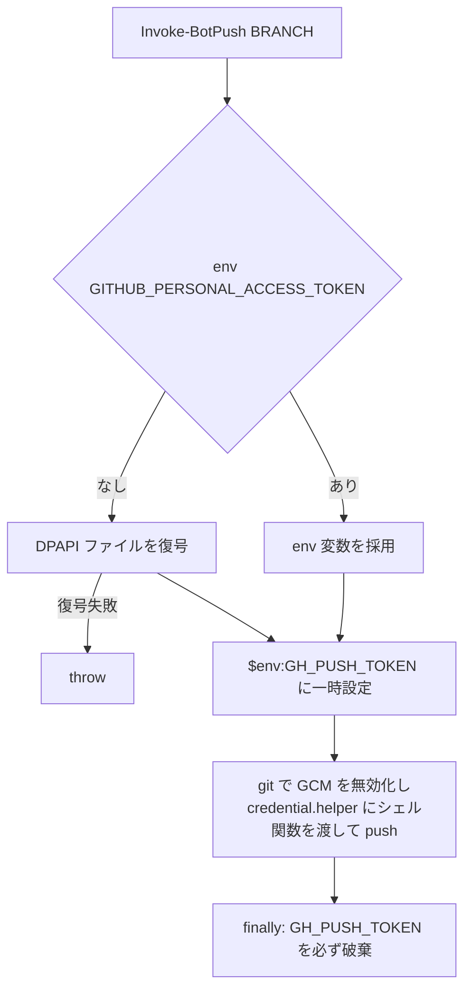

# 日次バッチ設計書インデックス

`empty-can/LLMs` リポジトリで Windows タスクスケジューラから毎日実行される 2 つのバッチの設計書。
**2 つは疎結合**（役割・入出力・失敗時の影響範囲が独立）なので、設計書もバッチ単位で分割している。

| ドキュメント | バッチ | 起動 | 役割 |
|---|---|---|---|
| [doc-summary-bot.md](./doc-summary-bot.md) | `CC-DocSummaryBot` | 毎日 15:00 | 公式 `llms.txt` を取り込み、更新差分から人間向けサマリを LLM 生成する |
| [ja-follow-watch-bot.md](./ja-follow-watch-bot.md) | `CC-DocJaFollowBot` | 毎日 15:30 | 既存サマリの en 単独リンクに、ja 翻訳が追いついた時点で `[日本語]` リンクを純追記する |

## 2 つのバッチの関係



**唯一の結合点は「同一 bot ブランチと同一作業ツリーを共有すること」**である。片方が作業ツリーを
dirty のまま残すと、もう片方の前提チェックに引っかかる。この結合が過去 2 回の全面停止の原因に
なっているため、両バッチは手順 1 で異なる戦略の防御を持つ（各設計書参照）。

- 生成 bot: **止まらない**。不整合は退避・回収・HEAD への巻き戻しで解消し、例外を投げずに取り込みへ進む
- ja 追従 bot: **待つ**。生成 bot の実行中である可能性を考え、最大 20 分ポーリングしてから判定する

分離した理由は `run-ja-follow-watch.ps1` の `.DESCRIPTION` に「役割・実行頻度・失敗時の影響範囲・
モデル要否が異なる」と記されている。具体的には:

- 役割が異なる（原文→サマリ生成 vs 既存サマリへの ja 追従）
- 失敗時の影響範囲が異なる（生成失敗＝その日のサマリ欠落 / 注入失敗＝リンク追加の先送り）
- モデル要否が異なる（生成は `claude -p` 必須 / 注入は LLM 不要の純機械処理）

共有するのは**セキュリティ上慎重な push と git ラッパのみ**に限定している。

## 共通基盤: `doc-summary-common.ps1`

両バッチが dot-source する共通モジュール。二重保守による drift（特に push 実装）を防ぐのが目的。

| 要素 | 内容 |
|---|---|
| `$BOT_BRANCH` / `$BASE_BRANCH` | `bot/doc-summary` / `main` |
| `$TOKEN_FILE` | `~/.claude/doc-summary-bot-token.xml`（DPAPI 暗号化。同一ユーザー・同一マシンのみ復号可） |
| コンソール UTF-8 強制 | `claude -p` / `python` の UTF-8 出力を CP932 でデコードして壊さないため。過去に result JSON の parse が壊れ、Phase 3 PASS 済み生成物が破棄された実績あり |
| `Write-Log` | 呼び出し元の `$LOG_FILE` へ `yyyy-MM-dd HH:mm:ss [LEVEL] message` 形式で追記 |
| `Invoke-Git` | 成否を `$LASTEXITCODE` のみで判定する git ラッパ。git は正常時も stderr に書くため、EAP=Stop 下では成功した `checkout` すら異常終了になる。関数内だけ EAP を Continue に下げる |
| `Invoke-BotPush` | bot ブランチ限定のセキュア push（下記） |

### push の境界設計



- **PAT を URL・引数・ログに一切出さない**。inline credential helper 経由で子 `sh` にだけ渡す
- GCM（Git Credential Manager）を `-c credential.helper=` で一旦無効化してから差す（無人実行で GUI プロンプトを出さないため）
- 呼び出し側は push 直前に現在ブランチを assert する（**二重防御**。`main` へは構造的に push しない）
- `main` へのマージは人間の判断。bot は `bot/doc-summary` までしか触らない

## ログと運用

| バッチ | ログ | 備考 |
|---|---|---|
| doc-summary | `work/doc-summary-bot/run-<yyyyMMdd-HHmmss>.log` | gitignore |
| ja-follow | `work/ja-follow-watch/run-<yyyyMMdd-HHmmss>.log` | gitignore |

```powershell
# 直近の成否を俯瞰する
Get-ChildItem work\doc-summary-bot\run-*.log | Sort-Object Name |
  Select-Object -Last 14 | ForEach-Object {
    "{0} {1}" -f $_.Name, (Select-String $_.FullName -Pattern '終了:' | Select-Object -Last 1).Line
  }

# タスクの最終結果（0 = 正常）
Get-ScheduledTask CC-DocSummaryBot | Get-ScheduledTaskInfo | Select-Object LastRunTime, LastTaskResult
```

**ログのサイズは一次切り分けに使える**。500 バイト前後で終わっていれば前提チェックでの即死
（ja 追従 bot のみ。生成 bot は 2026-08-02 以降このモードでは止まらない）、
1 KB 未満かつ所要 0 秒なら `bash` 解決の失敗、`終了:` 行が無ければ ExecutionTimeLimit による強制終了である。
