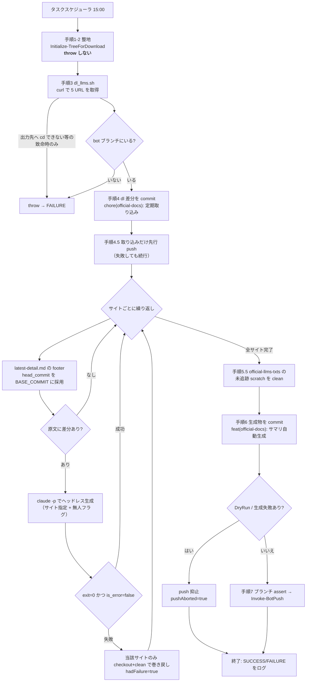
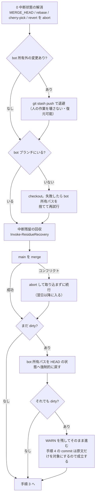
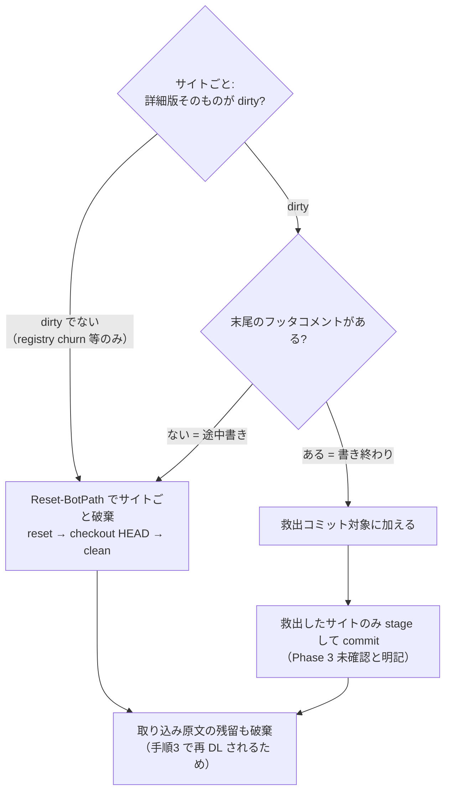

# doc-summary bot 設計書

公式ドキュメントの `llms.txt` / `llms-full.txt` を毎日取り込み、前回からの差分を
人間向けの changelog 風サマリとして LLM に生成させる無人バッチ。

- 実体: `.claude/scripts/run-doc-summary.ps1`
- 起動: タスクスケジューラ `CC-DocSummaryBot`（毎日 15:00 / Interactive logon / ExecutionTimeLimit **PT1H**）
- 引数: `-Site all|claude-code-docs|mcp` / `-DryRun`（push のみ抑止）/ `-SkipDownload` / `-RestoreBranch`
- 共通基盤: `doc-summary-common.ps1`（[README](./README.md) 参照）

## 入出力

| 区分 | 対象 |
|---|---|
| 入力（取得元） | `download_list.tsv` の 5 URL（`code.claude.com/docs/` の `llms.txt` / `llms-full.txt` / `en/claude_code_docs_map.md`、`modelcontextprotocol.io` の `llms.txt` / `llms-full.txt`） |
| 中間（原文） | `official-llms-txts/<host>/...` — **上書きフラグ全行 TRUE のためスナップショットは残らない** |
| 出力（成果物） | `official-doc-update-summary/<slug>/latest-detail.md` / `latest.md` と `archives/latest[-detail]/<日付>.md` |
| 出力先ブランチ | `bot/doc-summary`（push もここ限定） |
| ログ | `work/doc-summary-bot/run-<yyyyMMdd-HHmmss>.log` |

サイト定義（`$SITES`。SKILL のサイト設定テーブルと一致させること）:

| Slug | 原文 | 詳細版 |
|---|---|---|
| `claude-code-docs` | `official-llms-txts/code.claude.com/docs/` | `official-doc-update-summary/claude-code-docs/latest-detail.md` |
| `mcp` | `official-llms-txts/modelcontextprotocol.io/` | `official-doc-update-summary/mcp/latest-detail.md` |

## 全体フロー



## 手順の要点

### 手順 1-2: 整地（`Initialize-TreeForDownload`）— **throw しない区間**

この設計で最も重要な性質は「**手順 3 の dl へ必ず到達すること**」である。

要約生成は失敗しても翌日以降に作り直せる。しかし `llms.txt` の日次取り込みは、`download_list.tsv`
の URL が履歴を持たない live URL であるため、**その日の断面はその日にしか取れない**。取り逃した日の
分は後から日次差分として復元できない（実害: 2026-07-29 の中断残留により 4 日間 dl に到達できず、
4 日分のスナップショットを恒久的に失った）。

そこで手順 1-2 は例外を投げない構造にしている。個々の回復操作を `Invoke-Safely` で包み、失敗しても
WARN をログに残して次へ進む。git リポジトリの不整合は**退避・回収・HEAD への巻き戻し**で解消する。



**bot が所有するのは `official-llms-txts/` と各サイトの成果物ディレクトリだけ**である。
`official-doc-update-summary/README.md` のような人手管理ファイルや、リポジトリ内の他の作業は
所有外として扱い、**破棄せず `git stash` へ退避**する（`git stash list` から復元できる）。
bot が人の作業を壊すことも、人の作業のせいで bot が止まることも避けるための扱いである。

唯一残した停止条件は手順 4 の直前にある。整地が throw しない以上「bot ブランチへ移れないまま
dl を終える」可能性が残るため、**その状態では取り込みを commit せずに停止する**（別ブランチを
汚さないため。DL 済みファイル自体は作業ツリーに残る）。

#### 中断残留の回収（`Invoke-ResidueRecovery`）



判定を「詳細版そのものが dirty か」に限っているのは、同じサイトディレクトリ配下にある
`watch/registry.json`（ja 追従 bot が毎回書き換える）や `archives/` が dirty なだけで「書き終わり」と
誤判定しないためである。それらは `.md` から再導出できるので破棄してよい。

破棄は `git checkout -- <dir>` 単体では不十分で、**先に `git reset` で index を HEAD に揃える**。
`checkout -- <path>` は index から復元するため、手順 6 の `git add` 直後に kill された場合の
staged 残留がそのまま生き残ってしまうからである。破棄する未追跡ファイルは事前に `git clean -nd` で
一覧化してログへ残す。

`-SkipDownload` 指定時は原文の残留を破棄しない（再 DL されないため）。その場合はツリーが dirty のまま
残るが、それも WARN を残して続行する。

> **フッタは「書き終わり」の証拠であって「レビュー通過」の証拠ではない**。SKILL はフッタを手順 11
> （書き出し）で書き、Phase 3 の第三者レビューは手順 13 である。したがって救出された成果物は
> 未レビューの可能性がある。品質ゲートは人間の bot→main マージ段階に置く設計なので破棄はせず、
> ログとコミットメッセージに「Phase 3 未確認」と明示して人間の判断に委ねる。

> **設計意図**: 生成が失敗・中断しても **日次の dl commit だけは必ず残す**。`llms.txt` は現在断面しか
> 取得できず履歴が無いので、dl が飛んだ日の分は後から日次差分に分けて復旧できない。したがって
> 「取り込みを止めないこと」を生成成功より優先する。

### 手順 3-4: 取り込みと分離コミット

`dl_llms.sh` が `download_list.tsv` を 1 行ずつ読み、`official-llms-txts/` へ `curl -L -f` で保存する。
上書きフラグが TRUE なら単純上書き、FALSE なら既存を `<folder>/archive/<name>_<timestamp>.<ext>` へ退避して
から取得する（**現行 TSV は全行 TRUE なので退避分岐は動かない**）。

取得後ただちに `git add official-llms-txts` → `chore(official-docs): 公式 llms.txt 定期取り込み (bot)` で
コミットする。**取り込みと生成のコミットを分離するのが設計の要**で、これにより生成が失敗しても原文の
日次スナップショットは git 履歴に残る。

続けて**手順 4.5 で取り込みだけを先に push する**。手順 5 の生成は 30 分以上かかることがあり、
そこで落ちるとその日のスナップショットがローカルにしか存在しない状態が続く。ローカルを失えば
その日の断面は二度と再現できないため、生成の成否を待たずにリモートへ逃がす。この push が失敗しても
手順 7 で再度 push されるので、実行は止めない（1 日あたり最大 2 回 push することになる）。

> **注意: 個別 URL の DL 失敗は検知されない**。`dl_llms.sh` は `set -e` を使っておらず、curl が失敗しても
> `Failed: <url>` を出力してループを続け、最後の `echo` の終了コード（0）で終わる。ラッパー側の
> `if ($LASTEXITCODE -ne 0) { throw }` が発火するのは、実質的に出力先へ `cd` できなかった場合だけである。
> 結果として、一部 URL が落ちた日は「差分なし」または部分的な差分として静かに通過する。改善余地あり。

### 手順 5: サイト単位の生成

`BASE_COMMIT` は前回サマリのフッタ `head_commit:` から取る（＝前回生成に使った原文の断面）。
`HEAD_COMMIT` は手順 4 直後の HEAD。この 2 点間に原文差分が無ければ生成をスキップする。

```
claude -p "/update-official-doc-summary --site <slug> --automated"
    --model opus
    --permission-mode acceptEdits
    --allowedTools "<限定リスト>"
    --output-format json
```

- 無人であることは **`--automated` 引数**で SKILL へ伝える（環境変数経由だとモデルが命令形を改変して
  allowedTools 不一致で拒否され、Phase 3 がスキップされ得る）
- `allowedTools` は**単純コマンドのみ**許可される。`cd X && git mv A B` のような複合コマンドは
  先頭トークンが一致せず拒否されるため、SKILL 側で単純コマンドに分解させる必要がある
- 成否は **exit code と result JSON の `is_error` の二重判定**。stdout 末尾の `"type":"result"` 行だけを
  取り出して解釈し、stderr 混入で JSON parse が壊れるのを防ぐ
- 失敗したサイトは `checkout` + `clean` でそのサイトのディレクトリだけ巻き戻す（他サイトと dl commit は保持）

SKILL 側の生成処理は 14 ステップで、要点は次のとおり。

| # | 処理 |
|---|---|
| 1-2 | 前回サマリから BASE_COMMIT 決定 → HEAD_COMMIT と差分検出 |
| 3-4 | 入力ドキュメント読み込み → ページ分類 |
| 5-6 | テンプレート読み込み → **詳細版を英語で生成** |
| 7 | Phase 1 セルフレビュー（英語段階） |
| 8-9 | 日本語化 → Phase 2 セルフレビュー |
| 10-11 | 旧版を `archives/` へ退避 → 詳細版書き出し |
| 12 | ライト版生成（`derive_light.py` で機械抽出、見出しを詳細版アンカーへリンク化） |
| 13 | **Phase 3 第三者レビュー**（sub-agent `doc-summary-reviewer` / sonnet。無人実行では必須） |
| 14 | 完了報告 |

### 手順 6-7: コミットとプッシュ

`git add official-doc-update-summary` → `feat(official-docs): 公式ドキュ更新サマリ自動生成 (bot)`。
push は `DryRun` でも生成失敗ありでも抑止し、実行時はブランチ assert を経て `Invoke-BotPush` を呼ぶ。

## 生成されるコミット

| 種別 | メッセージ | 作成者 |
|---|---|---|
| 取り込み | `chore(official-docs): 公式 llms.txt 定期取り込み (bot)` | 手順 4 |
| サマリ | `feat(official-docs): 公式ドキュ更新サマリ自動生成 (bot)` | 手順 6 |
| 救出 | `feat(official-docs): 公式ドキュ更新サマリ自動生成 (bot・中断分の遅延コミット/Phase 3 未確認: <slug>)` | 手順 1 |

> **既知の不整合**: 実際には SKILL 側が生成物を先にコミットしてしまうことがあり、その場合手順 6 は
> 「生成サマリの差分なし」になる。さらに SKILL が作るメッセージ書式はサイト間で不統一
> （例: `feat(official-docs): 公式ドキュ更新サマリ生成 (mcp・2026-07-28〜2026-08-01)`）。未整理。

## 失敗モードと防御

| 症状 | 原因 | 防御・対処 |
|---|---|---|
| ログ 932 B・所要 0 秒で FAILURE | PATH 先頭の WindowsApps `bash.exe`（WSL 実行エイリアス）を掴む | `Resolve-BashExe` が Git 同梱 bash を最優先し、PATH 由来候補から `\WindowsApps\` を除外（2026-07-28 修正） |
| `終了:` 行が無いまま途切れる | 生成が長引き ExecutionTimeLimit を超過して kill | **未対処**。PT1H → PT2H への引き上げが課題（実測 cc-docs 41 分 + mcp 15 分 = 56 分） |
| 毎日 562 B で即 FAILURE | 前回の中断残留で作業ツリーが dirty | 手順 1-2 が自動回収して続行（2026-08-02 実装）。もはや停止しない |
| merge 途中でツリーが残る | `main` 取り込みのコンフリクト、または前回の中断 | 手順 1-2 の冒頭で `MERGE_HEAD` 等を検出して abort。取り込めない場合も**取り込まずに dl を続行**する |
| 人の作業中に bot が起動 | 同じ作業ツリーを共有している | bot 所有外の変更は `git stash` へ退避して続行。破棄しない（`git stash list` から復元） |
| 生成成功なのに破棄される | UTF-8 デコード失敗で result JSON の parse が壊れ `is_error` を誤判定 | 共通基盤でコンソール UTF-8 を強制（2026-06-07 の実害を受けた対処） |

## 制約・注意

- **停止期間は日次差分に分けて復旧できない**。`download_list.tsv` の URL は日付指定のできない live URL で、
  上書きフラグ全行 TRUE のため中間スナップショットも残らない。復旧は「停止前最終 dl 〜 実行日」の
  集約 1 本になる
- 定期実行中（15:00 / 15:30）に手動実行を重ねない。同一 bot ブランチを共有するため衝突する
- `-DryRun` は **push だけ**を抑止する。dl も生成（＝ Opus 呼び出し）も実際に走る点に注意
- frontmatter の `作成日` / `対象期間` が実コミット日付より 1 日前になるのは **仕様**（SKILL の
  「PT -1 日ルール」。`generated_at_full` だけが実時刻）。不具合ではないので直さないこと
- **bot 自身のスクリプトを未コミットで編集したまま 15:00 を迎えると、その編集は bot 所有外の変更
  として `git stash` へ退避される**（実例: 2026-08-03 15:00 の実行が本ファイルの修正版自身を退避した）。
  失われはしないが、編集は 15:00 までにコミットしておくか、`git stash list` から復元すること

## 改訂履歴

| 日付 | 内容 |
|---|---|
| 2026-07-28 | `Resolve-BashExe` を WSL エイリアス回避に修正（`4c608df`） |
| 2026-08-03 | 手順 4.5 を追加し、生成の成否を待たずに取り込みコミットを先行 push するようにした |
| 2026-08-02 | 手順 1（前提チェック）と手順 2（ブランチ準備）を `Initialize-TreeForDownload` に統合し、**dl へ到達するまで throw しない**構造へ変更。中断状態の abort・bot 所有外変更の stash 退避・中断残留の救出/破棄・merge 失敗時の続行・HEAD への強制巻き戻しを段階的に試みる。commit 前のブランチ確認だけを停止条件として残した |
