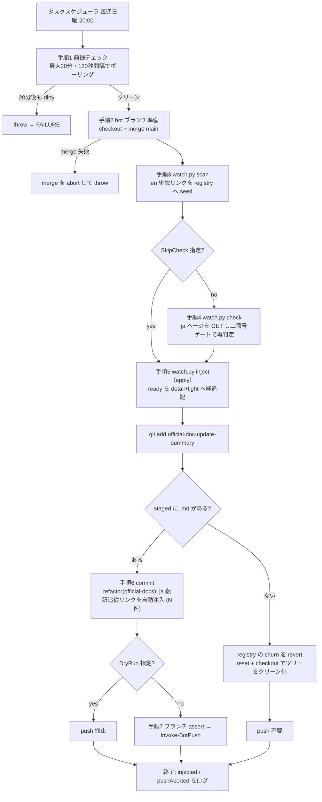
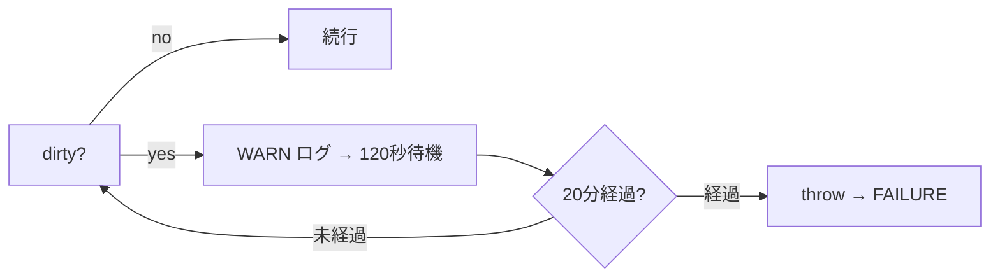
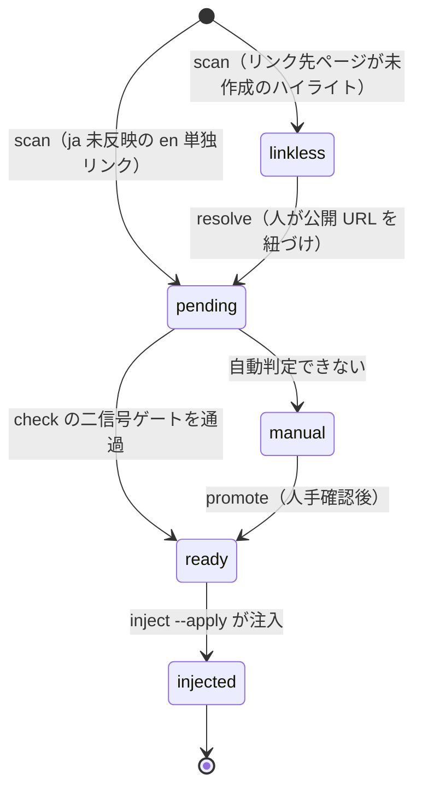

# ja 追従 watch bot 設計書

> **⚠ 再設計中（2026-08-11〜）**: 本バッチを dl・要約と直列に起動し、実行日判定を
> 先頭へ置く方針が決まっている。検討中の設計は Git 未追跡の
> `.claude/work/flow-redesign/` にあり、合意後に本設計書を全面改訂する。
> **以下は改訂前の現行実装の記述**である。

生成済みサマリの **en 単独リンク**を監視し、公式 ja ドキュメントに翻訳が反映された時点で
`[日本語]` リンクを純追記する無人バッチ。LLM を使わない機械処理。

- 実体: `.claude/scripts/run-ja-follow-watch.ps1`（検出・注入の本体は `watch.py`）
- 起動: タスクスケジューラ `CC-DocJaFollowBot`（**毎週日曜 20:00** / Interactive logon / ExecutionTimeLimit PT1H）
- 引数: `-DryRun`（push のみ抑止）/ `-SkipCheck`（ja 再チェックを省略しオフライン実行）/ `-RestoreBranch`
- 共通基盤: `doc-summary-common.ps1`（[README](./README.md) 参照）

## なぜ必要か

サマリ生成時の規約（req3 / req4）により、

- ja 翻訳が追いついていないセクションリンクは **en 単独**で出力する
- 公式ページ自体がまだ存在しないハイライトは **リンク無し**で出力する

後から ja が反映されたときにリンクを足す作業は、**本文を一切変えない純追記**であり、対象は
生成時点で完全に決まっている。

| 要素 | 決まり方 |
|---|---|
| ja URL | en URL の `/docs/en/` を `/docs/ja/` に置換 |
| アンカー | en と同一（Mintlify は ja 見出しにも英語 slug の id を振る） |
| 編集内容 | `[English](<en>)` → `[日本語](<ja>) / [English](<en>)`（detail と light の両方） |

判断が要るのは「ja が本当に反映されたか」だけなので、そこだけを**二信号ゲート**で判定して自動化する。
`watch.py` は決して push しない。push は PowerShell 側の唯一の人間/CI 境界に集約する。

## 入出力

**対象サイトは `claude-code-docs` のみ**。`watch.py` の `summary_root()` が
`official-doc-update-summary/claude-code-docs` を返す実装で固定されており、`--site` 引数も無い。
`mcp` サイトの生成物は scan / check / inject いずれの対象にもならない。

| 区分 | 対象 |
|---|---|
| 入力 | `official-doc-update-summary/claude-code-docs/` の live + archive サマリ、および live な ja ドキュメント（HTTP GET） |
| 状態 | `official-doc-update-summary/claude-code-docs/watch/registry.json`（**リポジトリにコミットして run 間で状態を持続**） |
| 出力 | 上記サマリ（detail / light）へのリンク追記のみ。本文不変 |
| ログ | `work/ja-follow-watch/run-<yyyyMMdd-HHmmss>.log` |

## 全体フロー

## 手順の要点

### 手順 1: 生成 bot の完了待ち（リトライ待機方式）

生成 bot は 15:00 起動だが所要時間が数分〜1 時間超とばらつくため、固定オフセットでは
まだコミットしていない状態と衝突しうる。そこで**即失敗させず、最大 20 分・120 秒間隔でポーリング**
してから判定する（ExecutionTimeLimit 1h に収まる範囲）。

> **この待機は競合の解決策にならなかった**。旧構成（日次 15:30 起動）では「15:30 起動 + 20 分待機
> ＝生成が 15:50 までに終わらなければ必ず失敗」という構造で、2026-07-14 / 08-07 / 08-08 / 08-11 に
> 実際に失敗した。生成の所要は差分量で決まりこちらでは制御できないため、オフセットや待機時間を
> 広げる方向では解決しない。2026-08-11 に起動を毎週日曜 20:00（生成の ExecutionTimeLimit 満了後）へ
> 移して競合を構造的に排除した。**待機自体は手動実行時と異常系の保険として残している**。
> 待機回数が 0 でなければ生成が長期化している兆候として読める。

これは**レース（生成 bot がまだ走っている）を吸収するための仕組み**であり、生成 bot が中断残留を
残した「恒久ブロック型」は救済できない（20 分待っても消えないため）。恒久ブロック型への対処は
生成 bot 側の `Initialize-TreeForDownload` が担う。

### 手順 3-5: 本バッチが呼ぶ 3 サブコマンド

`watch.py` のサブコマンドは 5 つ（`scan` / `check` / `inject` / `promote` / `resolve`）あるが、
**日次バッチが呼ぶのは先頭 3 つだけ**。残る 2 つは人手専用で、本バッチのスコープ外である。

| サブコマンド | 呼出 | ネットワーク | ファイル編集 | 内容 |
|---|---|---|---|---|
| `scan` | 手順 3 | 不要 | なし | live + archive のサマリから en 単独リンクを抽出し registry へ seed。**冪等**（既存項目の status は保持） |
| `check` | 手順 4 | 必要 | なし | `pending` / `manual` の各項目を live ja ドキュメントと突き合わせ、二信号ゲートを通れば `ready` へ |
| `inject --apply` | 手順 5 | 不要 | あり | `ready` を detail+light へ注入。`--commit` は使わず PowerShell 側で制御 |
| `promote` | 人手 | 不要 | なし | 人が確認した `manual` 項目を `ready` へ昇格させる |
| `resolve` | 人手 | 不要 | なし | 公式ページが未作成だった `linkless` 項目に、公開された URL を紐づける |

registry の状態遷移:

**`manual` は `check` を何度回しても自動では `ready` にならない**。`check` が見る強度指標は `scan` 時点で
固定されるため、一度 `manual` に落ちた項目を動かせるのは人手の `promote` だけである。同様に `linkless`
（公式ページ自体が未作成のケース）は `resolve` で URL を与えるまで滞留し続ける。**日次バッチだけでは
この 2 つの滞留は解消しない**ので、件数の推移を定期的に見る必要がある。

**二信号ゲート**（`check` の判定条件）:

1. ja ページに当該アンカー `id` が存在すること
2. 判明している場合、翻訳されない**コードトークン**が当該箇所に存在すること

見出しだけ機械翻訳されてアンカーが生えたが中身が未翻訳、といった偽陽性を弾くための二重確認である。

> **注記**: 注入処理（`inject_ja_into_text`）は「未注入の**全出現**に前置し、挿入件数を返す」実装で、
> 注入済み箇所は二重注入しないよう除外される。`watch.py` の docstring が言う「置換数はちょうど 1」は
> 設計上の前提であって、コードが assert しているわけではない。

### 手順 6: 「静かな日」の churn 対策

`inject --apply` は注入の有無にかかわらず registry.json の `last_checked` 等を書き換える。
この churn をそのまま残すと**翌日の run の未コミット判定に引っかかる**（＝両バッチを止める）。

そこで `git add` 後に staged な `.md` の有無を見て分岐する。

- `.md` あり → 注入があった日。registry ごとコミットし push
- `.md` なし → 静かな日。`git reset` + `git checkout` で registry の churn を破棄しツリーをクリーンに戻す
  （registry は `.md` から再導出可能なので捨ててよい）

コミットメッセージは注入件数と対象一覧を含む複数行で、**BOM 無し UTF-8 / LF の一時ファイルに書いて
`git commit -F` で渡す**（here-string 経由だと文字化けや CRLF 混入が起きる）。

### 手順 7: push

注入があった日だけ push する。`DryRun` なら抑止。実行時はブランチ assert を経て `Invoke-BotPush`。

## 生成されるコミット

| 種別 | メッセージ |
|---|---|
| 注入あり | `refactor(official-docs): ja 翻訳追従リンクを自動注入 (N件・watch bot)` + 対象一覧 |
| 注入なし | コミットしない（ツリーをクリーンに戻して終了。ログは `injected=False` の SUCCESS） |

## 失敗モードと防御

| 症状 | 原因 | 防御・対処 |
|---|---|---|
| 「未コミットの変更があります」で FAILURE | 生成 bot がまだ走っている（レース） | 20 分のポーリング待機で吸収（`c826238`）。ただし旧構成（日次 15:30）では生成が 15:50 を跨ぐ日に必ず失敗した（2026-07-14 / 08-07 / 08-08 / 08-11）。2026-08-11 に起動を毎週日曜 20:00 へ移して構造的に排除 |
| 20 分待っても FAILURE が続く | 生成 bot の中断残留（恒久ブロック型） | 生成 bot 側 `Initialize-TreeForDownload` の管轄。本バッチ側では救済不可 |
| 日本語が化ける | Windows 既定 CP932 での python I/O | `$env:PYTHONUTF8=1` / `PYTHONIOENCODING=utf-8` を設定してから `watch.py` を起動 |
| `watch.py` の進捗が失敗扱いになる | python が進捗を stderr に書く | `Invoke-WatchPy` が関数内だけ EAP を Continue に下げ、成否は `$LASTEXITCODE` で判定 |
| 翌日以降ずっと dirty | 静かな日の registry churn を残した | 手順 6 の revert 分岐で防止 |

## 制約・注意

- 注入は**本文不変の純追記のみ**（既存リンクの前に `[日本語](...) / ` を挿す）。それ以外の編集は行わない
- `linkless`（公式ページ未作成）と `manual`（自動判定不可）は本バッチでは解消しない。
  それぞれ `watch.py resolve` / `watch.py promote` による人手対応が必要
- `cmd_inject` は `[English](<en_url>)` という形を探すため、将来ラベルの異なるリンクを注入する
  フェーズを足す場合は別途対応が必要
- registry は `official-doc-update-summary/claude-code-docs/watch/` 配下にあり、
  **リポジトリにコミットされる**（CI/別マシンでも状態が持続する設計）
- `manual` は人手確認待ちの滞留。件数が増えていないか定期的に見る

## 既知の課題（2026-08-11 調査・バックログ）

registry の内訳（2026-08-11）: `injected` 225 / `manual` 569 / `pending` 314 / `ready` 22 / `linkless` 5（計 1,135）。

1. **`live::` キーの陳腐化（registry の GC が無い）**
   `scan` は en リンクを `<name>::<en_url>` で登録し、live 断面のものは `live::` で入る。live は翌日には
   別期間のサマリへ置き換わるため、その後 ja ページが公開されて `ready` に上がっても `inject` が対象
   リンクを live 内に見つけられず `en link not in current files (regenerated?)` で恒久スキップになる。
   現在 22 件が該当（すべて 2026-06-21 / 06-24 に `ready` 化したもの）。
   **実害はない** — 22 件すべて archive 側に同一 URL の双子エントリがあり、そちらは既に `injected`
   （＝注入自体は完了している）。ただし実体のない `ready` が単調増加し、件数指標が誤解を招く。
   対処案は陳腐化した `live::` キーの GC、または archive へのキー付け替え。
2. **`manual` の人手ゲートが滞留している**
   本バッチが呼ぶのは `scan` / `check` / `inject` の 3 つで `promote` を含まないため、`manual` は人が
   `watch.py promote` を実行しない限り `ready` へ上がらない。2026-07 時点の 64 件から 569 件まで
   積み上がっている。`promote` 運用の整備かゲート設計の見直しが要る。

**2026-06-24 以降 24 回連続で注入 0 件**なのは、上記 2 点に加えて公式 ja ページ自体の更新が遅いため。
実測例として env-vars ページは en 331 変数に対し ja 308 変数で、en にあって ja に無い変数が 24 個、
逆に en から削除済みの `CLAUDE_CODE_TEAM_NAME` が ja に残っている（2026-08-11 時点）。
週次で足りると判断した根拠でもある。

## 改訂履歴

| 日付 | 内容 |
|---|---|
| 2026-08-11 | 起動を日次 15:30 から**毎週日曜 20:00** へ変更し、生成 bot との競合を構造的に排除（暫定措置。最終形は dl / 要約 / ja 追従の 3 ジョブ直列化）。あわせて上記の既知課題 2 件を記録 |
